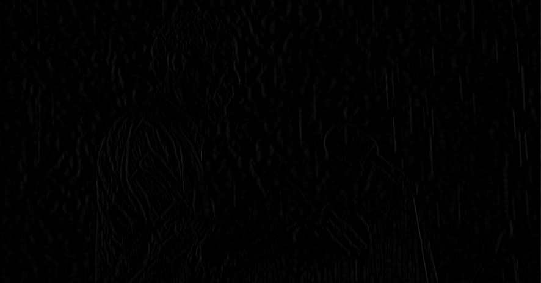

# Unidirectional  Global Sparse Model (UGSM)

version: 1.0.0

This repository is reproduction of paper [1] which removes rain from single image.
Although [1] provides Matlab implementation [2] someone cannot utilize it because of the license of Matlab.
To resolve this issue, this repository provides Python version of [2] which free to use without any consideration of license.

## Quick Start
```shell
$ pip install -r requirements.txt
$ cd src
$ python main.py
```


## Implementation Detail

Most of the operations used in [2] are replaced with `opencv`, `numpy` and `scipy` version except for `psf2otf`.
Since any numerical computing libraries in python doesn't provide alternative of `psf2otf`, this repository uses
function in [3].

## Sample Output




## References

[1] Liang-Jian Deng, Ting-Zhu Huang, Xi-Le Zhao, Tai-Xiang Jiang, 
    A directional global sparse model for single image rain removal, Applied Mathematical Modelling, 2018. 
    DOI:doi.org/10.1016/j.apm.2018.03.001

[2] Xi-Le Zhao (2020) UGSM [Source code]. 
https://github.com/zhaoxile/A-directional-global-sparse-model-for-single-image-rain-removal.git

[3] Alexandre Boucaud (2017) pypher [Source code].
https://github.com/aboucaud/pypher.git